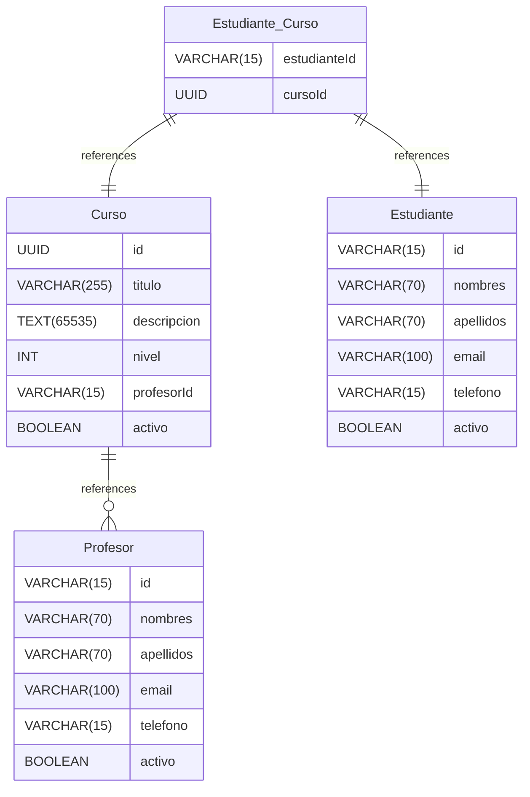

# modelo-universidad documentation
## Summary

- [Introduction](#introduction)
- [Database Type](#database-type)
- [Table Structure](#table-structure)
	- [Estudiante](#Estudiante)
	- [Profesor](#Profesor)
	- [Curso](#Curso)
	- [Estudiante_Curso](#Estudiante_Curso)
- [Relationships](#relationships)
- [Database Diagram](#database-Diagram)

## Introduction

## Database type

- **Database system:** Generic
## Table structure

### Estudiante

| Name        | Type          | Settings                      | References                    | Note                           |
|-------------|---------------|-------------------------------|-------------------------------|--------------------------------|
| **id** | VARCHAR(15) | 🔑 PK, not null , unique |  | |
| **nombres** | VARCHAR(70) | not null  |  | |
| **apellidos** | VARCHAR(70) | not null  |  | |
| **email** | VARCHAR(100) | not null , unique |  | |
| **telefono** | VARCHAR(15) | not null , unique |  | |
| **activo** | BOOLEAN | not null , default: true |  | | 

### Profesor

| Name        | Type          | Settings                      | References                    | Note                           |
|-------------|---------------|-------------------------------|-------------------------------|--------------------------------|
| **id** | VARCHAR(15) | 🔑 PK, not null , unique |  | |
| **nombres** | VARCHAR(70) | not null  |  | |
| **apellidos** | VARCHAR(70) | not null  |  | |
| **email** | VARCHAR(100) | not null  |  | |
| **telefono** | VARCHAR(15) | not null  |  | |
| **activo** | BOOLEAN | not null , default: true |  | | 

### Curso

| Name        | Type          | Settings                      | References                    | Note                           |
|-------------|---------------|-------------------------------|-------------------------------|--------------------------------|
| **id** | UUID | 🔑 PK, not null , unique |  | |
| **titulo** | VARCHAR(255) | not null  |  | |
| **descripcion** | TEXT(65535) | not null  |  | |
| **nivel** | INT | not null  |  | |
| **profesorId** | VARCHAR(15) | not null  | Curso_profesorId_fk | |
| **activo** | BOOLEAN | not null , default: true |  | | 

### Estudiante_Curso

| Name        | Type          | Settings                      | References                    | Note                           |
|-------------|---------------|-------------------------------|-------------------------------|--------------------------------|
| **estudianteId** | VARCHAR(15) | 🔑 PK, not null , unique | Estudiante_Curso_estudianteId_fk | |
| **cursoId** | UUID | 🔑 PK, not null  | Estudiante_Curso_cursoId_fk | | 

## Relationships

- **Curso to Profesor**: many_to_one
- **Estudiante_Curso to Estudiante**: one_to_one
- **Estudiante_Curso to Curso**: one_to_one

## Database Diagram

